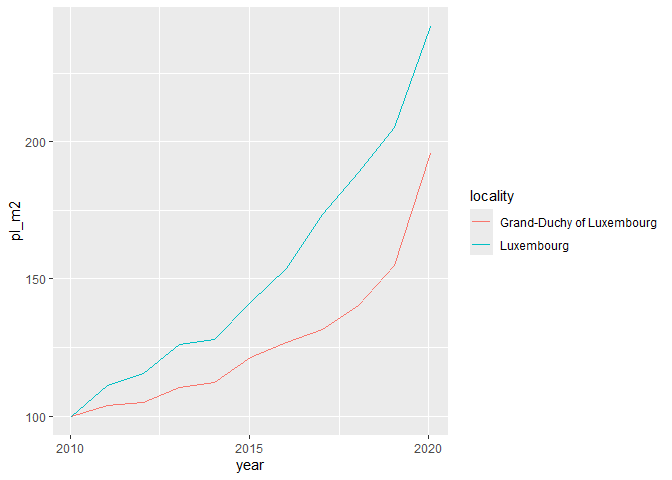

<!-- README.md is generated from README.Rmd. Please edit that file -->

# How to run

- clone repo with
  `git clone git@github.com:Bokola/Reproducible-analytical-pipelines-R.git`
- switch to `pipeline` branch with `git checkout pipeline`
- run pipeline with `targets::tar_make()`
- view output saved on `analyse_data.html`

# rapR

<!-- badges: start -->

[](https://github.com/Bokola/Reproducible-analytical-pipelines-R/actions/workflows/R-CMD-check.yaml)
<!-- badges: end -->

The goal of rapR is to …

## Installation

You can install the development version of rapR from
[GitHub](https://github.com/) with:

``` r
# install.packages("devtools")
devtools::install_github("Bokola/Reproducible-analytical-pipelines-R")
```

## Example

This is a basic example which shows you how to solve a common problem:

``` r
library(rapR)
## basic example code
```

What is special about using `README.Rmd` instead of just `README.md`?
You can include R chunks like so:

``` r
data("commune_level_data")
data("country_level_data", package = "rapR")
commune_level_data <- get_laspeyeres(commune_level_data)
country_level_data <-  get_laspeyeres(country_level_data)
make_plot(country_level_data, commune_level_data, "Luxembourg")
```


